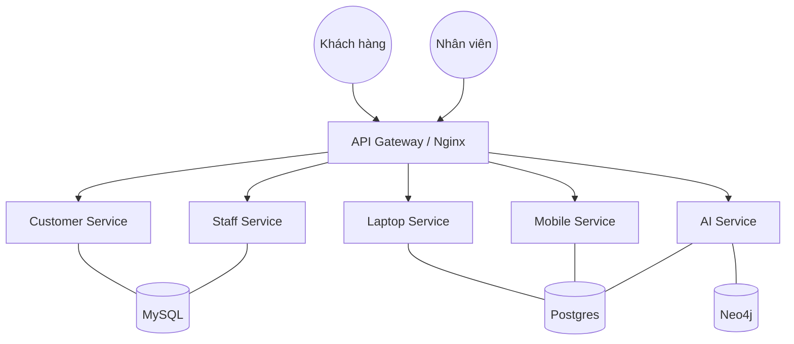
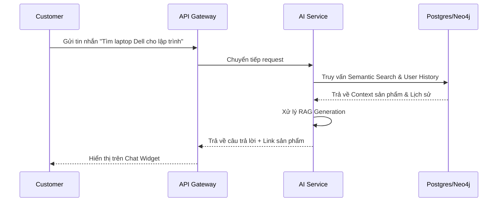

# BỘ THÔNG TIN VÀ TRUYỀN THÔNG
## HỌC VIỆN CÔNG NGHỆ BƯU CHÍNH VIỄN THÔNG

---

# KIẾN TRÚC VÀ THIẾT KẾ PHẦN MỀM

## TIỂU LUẬN

**Báo cáo: Xây dựng hệ thống E-commerce tích hợp AI Microservices (kiemtra01)**

| | |
|---|---|
| **Giảng viên** | PGS. TS. Trần Đình Quế |
| **Lớp** | E22CNPM01 |
| **Nhóm** | 01 |
| **Sinh viên** | Đỗ Thùy Anh - B22DCCN015 |

---

**Hà Nội, 2026**

---

## Mục lục

1. [Từ Monolithic đến Microservices và DDD](#1-từ-monolithic-đến-microservices-và-ddd)
   - 1.1 [Giới thiệu Monolithic Architecture](#11-giới-thiệu-monolithic-architecture)
   - 1.2 [Microservices Architecture](#12-microservices-architecture)
   - 1.3 [Domain Driven Design (DDD)](#13-domain-driven-design-ddd)
   - 1.4 [Case Study: Phân rã hệ thống](#14-case-study-phân-rã-hệ-thống)
2. [Phát triển Hệ E-Commerce Microservices (kiemtra01)](#2-phát-triển-hệ-e-commerce-microservices-kiemtra01)
   - 2.1 [Xác định yêu cầu](#21-xác-định-yêu-cầu)
   - 2.2 [Phân rã hệ thống theo DDD](#22-phân-rã-hệ-thống-theo-ddd)
   - 2.3 [Thiết kế Laptop Service](#23-thiết-kế-laptop-service)
   - 2.4 [Thiết kế Mobile Service](#24-thiết-kế-mobile-service)
   - 2.5 [Thiết kế Customer Service](#25-thiết-kế-customer-service)
   - 2.6 [Thiết kế Staff Service](#26-thiết-kế-staff-service)
   - 2.7 [API Gateway (Nginx/FastAPI)](#27-api-gateway-nginxfastapi)
3. [AI Service cho tư vấn sản phẩm](#3-ai-service-cho-tư-vấn-sản-phẩm)
   - 3.1 [Mục tiêu và Kiến trúc AI](#31-mục-tiêu-và-kiến-trúc-ai)
   - 3.2 [Dữ liệu hành vi người dùng (User Behavior)](#32-dữ-liệu-hành-vi-người-dùng)
   - 3.3 [Dự đoán hành vi với RNN/LSTM](#33-dự-đoán-hành-vi-với-rnnlstm)
   - 3.4 [Knowledge Graph (Neo4j)](#34-knowledge-graph-neo4j)
   - 3.5 [RAG (Retrieval-Augmented Generation)](#35-rag-retrieval-augmented-generation)
4. [Kiến trúc hệ thống hoàn chỉnh](#4-kiến-trúc-hệ-thống-hoàn-chỉnh)
   - 4.1 [Sơ đồ System Architecture](#41-sơ-đồ-system-architecture)
   - 4.2 [Luồng hệ thống End-to-End](#42-luồng-hệ-thống-end-to-end)
   - 4.3 [Triển khai Docker & Điều phối Service](#43-triển-khai-docker--điều-phối-service)
5. [Kết luận](#5-kết-luận)

---

## 1. Từ Monolithic đến Microservices và DDD

### 1.1 Giới thiệu Monolithic Architecture
Monolithic Architecture là kiến trúc truyền thống nơi toàn bộ chức năng của ứng dụng (UI, Logic, Database) được đóng gói trong một khối duy nhất. 

- **Ưu điểm**: Dễ phát triển giai đoạn đầu, dễ test local.
- **Nhược điểm**: Khó mở rộng (scale), rủi ro cao khi triển khai (một lỗi nhỏ làm sập cả hệ thống), sự phụ thuộc chéo (coupling) rất lớn.

### 1.2 Microservices Architecture
Kiến trúc Microservices chia nhỏ ứng dụng thành các dịch vụ độc lập, mỗi dịch vụ đảm nhận một chức năng nghiệp vụ cụ thể và giao tiếp qua API.

- **Nguyên tắc**: 
  - Độc lập về công nghệ (Polyglot).
  - Độc lập về cơ sở dữ liệu (Database per service).
  - Khả năng mở rộng linh hoạt theo từng service.

### 1.3 Domain Driven Design (DDD)
DDD cung cấp một phương pháp luận để phân tách hệ thống lớn dựa trên các bài toán nghiệp vụ thực tế. Hệ thống được chia thành các **Bounded Context**, đảm bảo mỗi service chỉ tập trung vào một Domain cụ thể.

---

## 2. Phát triển Hệ E-Commerce Microservices (kiemtra01)

### 2.1 Xác định yêu cầu
Dự án tập trung vào hệ thống bán lẻ thiết bị điện tử (Laptop, Mobile).
- **Yêu cầu chức năng**: Xem hàng, giỏ hàng, đặt hàng, quản lý kho, gợi ý AI.
- **Yêu cầu phi chức năng**: Chịu tải tốt, bảo mật, tích hợp AI chatbot.

### 2.2 Phân rã hệ thống theo DDD
Dựa trên kiến trúc dự án thực tế, chúng tôi chia thành 5 Context:
1. **Customer Context**: Quản lý khách hàng và giỏ hàng.
2. **Staff Context**: Quản lý vận hành và nhập liệu.
3. **Laptop Context**: Chuyên biệt cho sản phẩm máy tính xách tay.
4. **Mobile Context**: Chuyên biệt cho sản phẩm điện thoại.
5. **AI Context**: Xử lý logic tư vấn và gợi ý.

### 2.3 Thiết kế Laptop Service (Port 8003)
Quản lý danh mục laptop với database PostgreSQL.
```python
class Laptop(models.Model):
    name = models.CharField(max_length=255)
    brand = models.CharField(max_length=100)
    price = models.DecimalField(max_digits=12, decimal_places=2)
    stock = models.IntegerField(default=0)
```

### 2.4 Thiết kế Mobile Service (Port 8004)
Đối xứng với Laptop Service, xử lý domain điện thoại. Cấu trúc DB tách biệt để đảm bảo hiệu năng và khả năng mở rộng.

### 2.5 Thiết kế Customer Service (Port 8001)
Xử lý Transactional data (Giỏ hàng, Đơn hàng) sử dụng MySQL.
- **Cart**: Lưu trữ tạm thời sản phẩm user quan tâm.
- **Order**: Chốt dữ liệu mua hàng và đồng bộ kho.

### 2.6 Thiết kế Staff Service (Port 8002)
Dành riêng cho nhân viên vận hành, tích hợp Audit Log để theo dõi mọi thao tác thay đổi sản phẩm trên hệ thống.

### 2.7 API Gateway (Nginx/FastAPI)
Sử dụng Nginx làm entry point chính, kết hợp với một Micro-Gateway viết bằng FastAPI (Port 8000) để thực hiện routing thông minh và tiền xử lý request.

---


## 3. AI Service cho tư vấn sản phẩm

### 3.1 Mục tiêu và Kiến trúc AI
AI Service nhắm tới việc cung cấp trải nghiệm mua sắm thông minh thông qua hai kênh:
1. **Gợi ý tự động**: Hiển thị trên giao diện người dùng dựa trên sở thích và hành vi.
2. **Chatbot hỗ trợ**: Giải đáp thắc mắc và tư vấn trực tiếp theo ngữ nghĩa.

Kiến trúc AI sử dụng mô hình **Hybrid RAG**, kết hợp giữa tìm kiếm ngữ nghĩa (Semantic Search) và dữ liệu quan hệ từ Graph Database.

### 3.2 Dữ liệu hành vi người dùng (User Behavior)
Chúng tôi sử dụng dataset `data_user500.csv` chứa 4,000 bản ghi hành động của 500 người dùng.
- **Hành vi**: `view`, `click`, `add_to_cart`.
- **Đặc trưng**: Time-series data giúp mô hình hóa sự thay đổi sở thích theo thời gian.

### 3.3 Dự đoán hành vi với RNN/LSTM
Hệ thống triển khai 3 kiến trúc Deep Learning để so sánh hiệu năng dự đoán hành động tiếp theo của User:
- **RNN**: Mô hình cơ bản cho chuỗi.
- **LSTM**: Xử lý vấn đề vanishing gradient, phù hợp chuỗi hành vi dài.
- **BiLSTM**: Tận dụng thông tin ngữ cảnh cả hai chiều.

*Kết quả thực nghiệm*: BiLSTM cho độ chính xác (Accuracy) cao nhất, được chọn làm model chính cho inference.

### 3.4 Knowledge Graph (Neo4j)
Sử dụng Neo4j để xây dựng đồ thị tri thức:
- **Nodes**: `User`, `Product`.
- **Relationships**: `[:ACTED {action: 'view', timestamp: '...'}]`.
Điều này cho phép thực hiện **Collaborative Filtering** cực nhanh qua các truy vấn Cypher để tìm "Những người xem sản phẩm này cũng xem..."

### 3.5 RAG (Retrieval-Augmented Generation)
Đây là cốt lõi của chatbot thông minh:
1. **Retrieve**: Encode tin nhắn của user bằng model `all-MiniLM-L6-v2`. Tìm top-K sản phẩm liên quan trong PostgreSQL bằng Cosine Similarity.
2. **Augment**: Lấy lịch sử xem của User từ Neo4j để làm giàu ngữ cảnh.
3. **Generate**: Kết hợp context để trả về câu trả lời tự nhiên kèm thông tin sản phẩm thực tế.

---

## 4. Kiến trúc hệ thống hoàn chỉnh

### 4.1 Sơ đồ System Architecture
Dưới đây là sơ đồ kiến trúc microservices tổng thể:



### 4.2 Luồng hệ thống End-to-End
#### Luồng Chatbot AI tư vấn:


### 4.3 Triển khai Docker & Điều phối Service
Toàn bộ 9 container được quản lý bởi `docker-compose.yml`.
- **Network**: Sử dụng chung `my_network` (bridge) để các service gọi nhau bằng hostname.
- **Volume**: Persistence dữ liệu cho MySQL, Postgres và Neo4j.

---

## 5. Kết luận
Dự án **kiemtra01** đã hiện thực hóa thành công một hệ thống E-commerce hiện đại. Việc áp dụng Microservices giúp hệ thống linh hoạt, trong khi AI Service với công nghệ RAG và Graph Database mang lại giá trị gia tăng lớn trong trải nghiệm người dùng.

*Báo cáo Tiểu luận — Kiến trúc và Thiết kế Phần mềm — Nhóm 01 — 2026*

